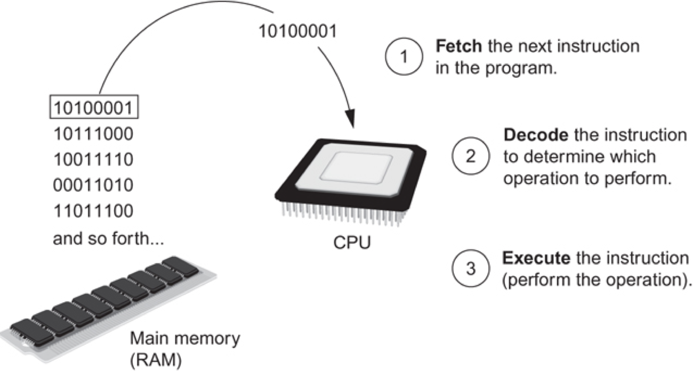
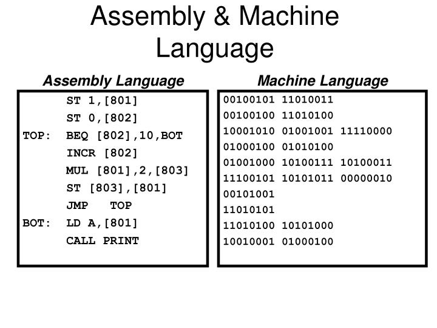
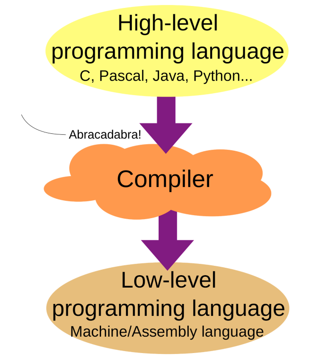

# Introduction

We explian how a program works and introduce concepts such as programming languages, compiler and interpreter.

## How a Program Works

A computer can be simplified as the following diagram:

### CPU

CPU is designed to perform simple operations on pieces of data: examples include reading data, adding, subtracting, multiplying, and dividing numbers.

It understands instructions written in machine language, also called machine code. Each brand of CPU has its own instruction set.

To carry out meaningful calculation, CPU must perform many machine-levle (low-level) operations in 0s and 1s (binary code).

### Program Execution

Program must be copied from secondary memory (hard disk or SSD) to RAM each time CPU executes it. CPU executes program in cycle:

- Fetch: read the next instruction from memory into CPU
- Decode: CPU decodes fetched instruction to determine which operation to perform
- Execute: perform the operation

## Programming Languages

Machine languages are impractical for people to write and understand. Computer scientists invented assembly languages that use short words (mnemonics) for instructions instead of binary numbers.

Nonetheless, computers can only understand and execute machine languages. Therefore there is a so-called **Assembler** to translate a assembly language to a machine language for execution by CPU.

However, assembly languages are close in nature to machine language. Both machine languages and assembly languages are low-level languages because they have low-level relatively simple instructions.

High-Level languages invented to allow simple creation of powerful and complex programs. There is no need to know how CPU works or write large number of instructions. They are more intuitive to understand.

As you can see, programs written in high-level languages must be translated into machine language to be executed.

## Constructs of a Programming Language

- Keywords: predefined words used to write program in high-level language
  - Each keyword has specific meaning. For example: `if`, `true`.
- Operators: perform operations on data
  - Example: math operators `+` and `-` to perform arithmetic
- Syntax: set of rules to be followed when writing program
- Statement: individual instruction used in high-level language
- Source code: statements written by programmer
- Syntax error: prevents code from being translated into machine code.

## Compiler and Interpreter

A compiler translates high-level language program into separate machine language program. Machine language programs are executable applications that can be executed at any time.

There is another way to run programs written in high-level langauges: using interpreter. An interpreter translates and executes instructions in high-level language program such as Python. It interprets and executes one instrunction at a time.

Of course, the interpreter is a machine code file excuted in a CPU. You can think an interpreter as a virtual machine that can understand high-level langugase instructions.

Python is an interpreter and Python programs are interprted (executed) by Python. A program language that requires an interpreter is often called a scripting langauge. A program written in scripting language is called a script.

However, the boundary between a compiler and an interpreter is not clear because there are compilers such as [Cython](https://cython.org/) that compiles Python source code to machine code. Another reason is that high-level languages such as Java or C# are using a virtual machine to run their code. A virtual machine is similar to an interpreter.

The key difference between a compiler and an interpreter is that a compiler compiles all instructions into an executable application and run the application in a separate step. An interpreter interpret and run one instruction at a time.

