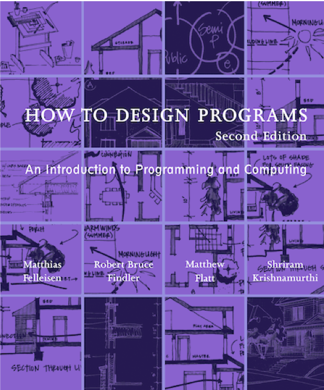
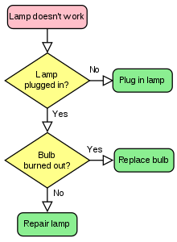

# Program Design

Program is the output (artifact) of programming. [Larry Wall](https://en.wikipedia.org/wiki/Larry_Wall), the creator of the popuplar [Perl programming language](https://en.wikipedia.org/wiki/Perl), explains the concept in a 5-minute video [Computer Programming in 5 minutes](http://youtu.be/UScm9avQM1Y): it is like writing a receipt in its simple form and you can solve more complex problems when you see patterns and build abstractions.

## Software Development Lifecycle

In a conceptual level, software development can be divided into five phases that are often interwined with each other.

- Requirment Analysis
- Design
- Implementation: coding
- Testing
- Evolution

A successful software project will go through many iterations of the five phases, especially when you use the [Agile software development Process](https://en.wikipedia.org/wiki/Agile_software_development)

Design is defined as the set of activities that you conduct to understand the problem, describe the problem and develop the solution. Design is followed by coding and testing. For any non-trivial problem, design is the most important part of the software development because it describes the problem solutions and testing criteria.

## Systmatic Program Design

For new programmers, the most common mistake is not spending enough time in program design. As most scientific disciplines, a systematic program design makes you a better programmer.

According to the above book [How to Design Programs](https://htdp.org/), the [Systematic program design](https://htdp.org/2020-8-1/Book/part_preface.html) has the following steps:

> 1. From Problem Analysis to Data Definitions: Identify the information that must be represented and how it is represented in the chosen programming language. Formulate data definitions and illustrate them with examples.
> 2. Signature, Purpose Statement, Header: State what kind of data the desired function consumes and produces. Formulate a concise answer to the question what the function computes. Define a stub that lives up to the signature.
> 3. Functional Examples: Work through examples that illustrate the function’s purpose.
> 4. Function Template: Translate the data definitions into an outline of the function.
> 5. Function Definition: Fill in the gaps in the function template. Exploit the purpose statement and the examples.
> 6. Testing: Articulate the examples as tests and ensure that the function passes all. Doing so discovers mistakes. Tests also supplement examples in that they help others read and understand the definition when the need arises—and it will arise for any serious program.

The whole program can be seen as a big function that consists of many small functions. A function takes an input, processing the input data and produces an output. The above steps are performed in many iterations for functions in different levels.

Note: The book [How to Design Programs](https://htdp.org/) is a free online book. It is used by several online free courses. A good one is the edX course [How to Code: Simple Data](https://www.edx.org/course/how-to-code-simple-data) from the University of British Columbia. One thing you can learn from the book/course is that all programming langauges are similar once you know the principles. Design is importatn and coding is the easiest part.

## Algorithm and Pseudocode

For complex problems, you first determine the high-level steps that must be taken to perform the task, i.e., you break down the required task into a series of steps. If a step represents a big task, you repeat the process to break into small steps that is easy to be solved.

An algorithm is a set of well-defined logical steps that must be taken to perform a task. You use the above divide and conquer method to develop algorithms at different levels.

When you design an algorithm, it is better to use pseudocode. Pseudocode is fake code that has no syntax rule, not meant to be compiled or executed. It is an informal language that you can create your pesudocode. Its purpose is to help algorithm design. At design phase, there is no need to worry about syntax errors. You can focus on algorithm design to sovle the problem. Later, pseudocode can be translated directly into actual code in any programming language.

You can even use diagrams such as [Flowchart](https://en.wikipedia.org/wiki/Flowchart). The following is an example from the wikipedia article.

You can see that it is pretty straightforward to understand, even by business persons who don't know programming.
