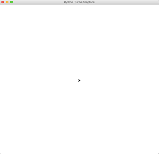
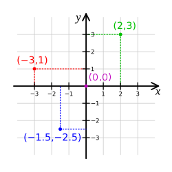

# Turtle Graphics

A typical python program has many functions therefore Python organizes a set of functions into a module. Python has a built-in [`turtle`](https://docs.python.org/3/library/turtle.html) module for a long history. It is fun to code with because its operation effects are visible and could produce interesting graphics. Here you use it to learn

- write sequential operations.
- define variables.
- use constant defintions.

## 1 Two Programming Patterns

Unlike using built-in functions, you need to import a module to use it. Once you import the `turtle` module, you can use it in two programming patterns:

- Procedure-oriented: all functions/operations are directly available in `turtle` module, you call the function as `turtle.operation(...)`. For example, `turtle.showturtle()` or `turtle.forward(100)`. Here the `turtle` is a module and the name after `.` is a function name.
- Object-oriented: the `turtle` module has many classes. A class is a blueprint to create objects. Like the real world, there are many objects interact/collaborate with each other to perform functions.
  - An **object** has both data and methods. You use an object's methods to run operations, usually manipulate its data or perform some I/O operations.
  - Unlike the procedure-oriented way, you need to create an object from its class before you can use it.
  - A **class** defines a blueprint for objects that share the same properties (data) and operations. For example, a `Student` class can have `student_id` and `major` properties and can have same set of operations such as `do_homework` and `take_test`. An object, also called an **instance** may have different instance data for `student_id` and `major`.
  - Use the dot notation `student.do_homework` to call an instance method. Here the `student` is an instance/object of the `Student` class and `do_homework` is its method.

You can use either procedure-oriented or object-oriented in Python interactive intepreter or IDLE3. However, when writing code in VS Code, it is better to use object-oriented pattern because VS Code can show better help information for objects and their methods.

## 2 The `Turtle`/`Pen` Class

The `turtle` module defines a `Turtle` class that has a canvas that you can draw pictures on it. It draws pictures as a turtle walking on earth. It has many methods that simulate operations a turtle can do such as go foward, turn right and etc.

Because the `Turtle` class draws on a canvas, it also works like a pen. Actually the `Turtle` class has an aliase named `Pen`. It has operations such as open down, penup, fillcolor.

## 3 The `pen` Instance

To avoid the confusing with `turtle` module name, we use `pen` as the variable name for a `Turtle` / `Pen` object.

### 3.1 Create an Instance

You call the `turtle.Turtle()` or `turtle.Pen()` to create an instance of `Turtle` class (also called `Pen`, they are the same class).

```py
import turtle
pen = turtle.Pen()  # same as turtle.Turtle()

# To make the graphics stay in a non-ineractive execution
turtle.done()
```

The first two lines are enough if you execute the code inside Python interprete or `idle3`. It is called an interactive execution. If you write the code in a `.py` file and run it from VS Code or from a command line, the canvas shows and disappears because the code completes. To make the canvas stay, call `turtle.done()`. `done` is a function defined in the `turtle` module.

### 3.2 The Canvas

The instance creates a canvas that has defulat properties such as width (`400px`), height(`300px`) and backgroundcolor (`'white'`). To distinguish the instance from the `turtle` module, we use a variable name `pen` for the instance of the `Turtle`/`Pen` class. When the `pen` instance is created, an arrowhead symbol in black color is drawn in the canvas like the following:



You can think the arrowhead as a mix of a turtle and a pen: it can move and draw at the same time.

### 3.3 The Coordinate

As in a math class, the canvas is modeled after a **Cartesian coordinate system** where a unit is a pixel in the canvas. The coordinates are not shown in the canvas but you can think it as the following:



## 4 Move

Create a file `turtle-demo.py` in an empty folder (a good habit for a new project), open VS Code in the folder. You can type the following code and watch the drawing process to see the operations in action. You may want to add one move at a time.

```python
import turtle

pen = turtle.Pen()

# a slow motion at speed 1. Speed 10 is the fastest
pen.speed(1)

pen.forward(50)
pen.right(90)
pen.forward(50)
pen.left(90)
pen.backward(100)
pen.sety(50)
pen.forward(150)

# For heading: 0 - east, 90 - north, 180 - west, 270 - south
pen.setheading(220)
pen.forward(100)

pen.goto(30, 30)
pen.home()

# To make the graphics stay in a non-ineractive execution
turtle.done()
```

## 5 Draw

- `pen.circle(50)`: draw a circle with a `50px` radius
- `pen.dot(20, 'blue')`: draw a blue dot with size of `20px`.
- `pen.shape('blank')`: don't show arrowhead.
- `pen.up()`: not drawing when moving
- `pen.down()`: drawing when moving
- `pen.width(10)`: set width to 10px
- `pen.color('brown')`: set pen color
- `pen.write('hi', font=("Arial", 18, "normal"))`: write the text using the specified `font`. `write` takes multiple parameters, use parameter name `font` to specify provided argument.

Demo code:

```python
import turtle

pen = turtle.Pen()

# a slow motion at speed 1. Speed 10 is the fastest
pen.speed(1)
pen.dot(20, 'blue')
pen.circle(50)
pen.width(10)
pen.forward(50)
pen.color('brown')
pen.up()
pen.forward(30)
pen.down()
pen.write('hi', font=('Arial', 18, 'normal'))
pen.shape('blank')

# To make the graphics stay in a non-ineractive execution
turtle.done()
```

## 6 Getting Input

The `turtle` module provide two input functions:

- `turtle.textinput(title, prompt)`: pop up an input box for a string.
- `turtle.numinput(title, prompt, default=None, minval=None, maxval=None)`: pop up an input box for a number. You can provide optinoal default value, minimum and maximum value. It asks you to input again if the number is out of range.

```python
import turtle

DEFAULT_NUMBER = 1000
MIN_NUMBER = 10
MAX_NUMBER = 10_000

turtle.bgcolor('blue')

pen = turtle.Pen()

num = turtle.numinput("Poker", "Your stakes:", DEFAULT_NUMBER, minval=MIN_NUMBER, maxval=MAX_NUMBER)

pen.color('orange')
pen.write(num, font=('Arial', 28, 'normal'))

turtle.done()
```

In the above code, please distinguish two different types of calls:

- Functions: `turtle.bgcolor()`, `turtle.pen()`, `turtle.numinput()`, and `turtle.done()` are functions in the `turtle` module.
- Methods: `pen.color()` and `pen.write()` are methods of an instance/object of a `Turtle` class. The instance is bound to variable `pen`.

It is a best practice to define constant values using meaningful variables names that use uppercase words seperated by underscore.

## Query Turtle's State

You can query the current states of a pen using methods such as `position`, `xcor`, `ycor`, `heading` and etc. The following is a demo:

```python
import turtle

TEXT_FONT = ('Arial', 18, 'normal')

pen = turtle.Pen()

pen.forward(100)
pen.left(90)
pen.forward(100)

postion = pen.position()
pen.write(postion, font = TEXT_FONT)

pen.goto(150, 150)
x_coordinate = pen.xcor()
y_coordinate = pen.ycor()
coordinate = f'x: {x_coordinate}, y: {y_coordinate}'
pen.write(coordinate, font = TEXT_FONT)

pen.setheading(180)
pen.forward(200)
pen.write(pen.heading(), font=TEXT_FONT)

# To make the graphics stay in a non-ineractive execution
turtle.done()
```

## 8 Resources

All the module, classes and operations used above are documente in [`turtle` - Turtle Grpahics](https://docs.python.org/3/library/turtle.html). The document documents the procedure functions thus it is not clear which methods can be used by `Pen`/`Turtle` class instances. As yo can see, VS Code can give contextual help.

[The beginner's guide to Python turtle](https://realpython.com/beginners-guide-python-turtle/) is a good introduction.

As always, there is no perfect document/help available, just try.
